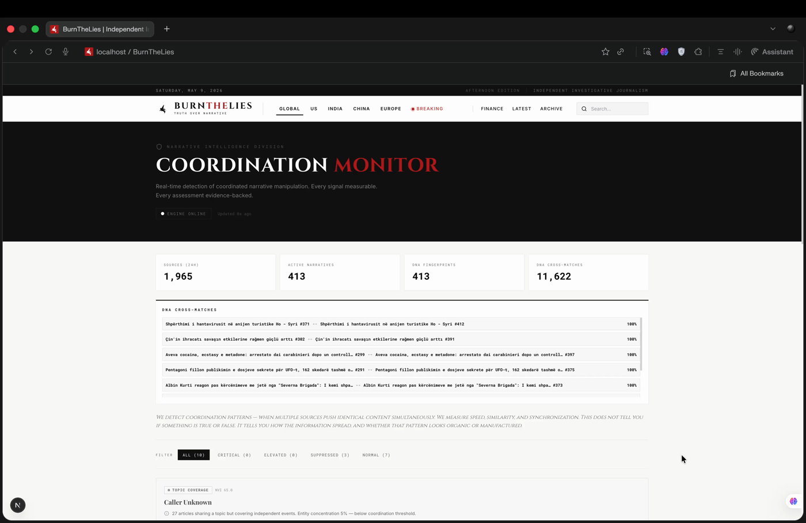

# BurnTheLies Intelligence

<p align="center">
  
  
  
  
</p>

<p align="center">
  <strong>A narrative velocity anomaly detection engine.</strong><br>
  Ingests 3M+ news articles per day from GDELT and Bluesky,<br>
  clusters related stories, and surfaces statistically unusual narrative patterns<br>
  through an 18-gate falsification pipeline.
</p>

<p align="center">
  
</p>

---

## See It In Action

<p align="center">
  <video src="assets/dashboard-demo.mp4" controls width="800"></video>
</p>

The dashboard shows narrative clusters ranked by NVI (Narrative Velocity Index), with alert levels, evidence packs, and cross-narrative campaign detection. Each cluster can be expanded to reveal source diversity, language spread, gate reasoning, and individual post timelines.

---

## What This Actually Does

Every day, GDELT's Global Knowledge Graph processes ~3 million news articles across 65+ languages. Most are normal journalism. A small fraction are coordinated narratives — the same story appearing simultaneously across unrelated outlets, in multiple languages, with unusual velocity patterns.

This system:

1. **Ingests** news from GDELT GKG (3M/day) and Bluesky Jetstream firehose (real-time)
2. **Embeds** articles using sentence transformers (384-dim)
3. **Clusters** articles into narrative threads via multi-resolution HDBSCAN (4 density levels: 3, 5, 10, 25 min cluster size)
4. **Falsifies** — eliminates everything that demonstrably *isn't* a coordinated narrative (wire syndication, single-source clusters, listicles, batch artifacts)
5. **Scores** what remains on Narrative Velocity Index — how suddenly and broadly a story is spreading
6. **Flags** the top ~10% as "elevated" and top ~0.4% as "critical" for human review

**It does not "detect coordination."** It measures narrative velocity with anomaly detection and filters out noise. What survives is worth a human looking at. That's the honest framing.

---

## Architecture

```
                        ┌──────────────────────────────────┐
                        │          INGESTION LAYER          │
                        │                                  │
                        │  GDELT GKG v2       Bluesky      │
                        │  (3M articles/day,   Jetstream    │
                        │   65+ languages,     WebSocket    │
                        │   15-min batches)    firehose     │
                        └──────────┬───────────────────────┘
                                   │
                                   ▼
                        ┌──────────────────────────────────┐
                        │        EMBEDDING & STORAGE        │
                        │                                  │
                        │  sentence-transformers (384-dim)  │
                        │  SQLite + WAL journaling          │
                        │  Content-hash deduplication       │
                        └──────────┬───────────────────────┘
                                   │
                                   ▼
                        ┌──────────────────────────────────┐
                        │    MULTI-RESOLUTION CLUSTERING    │
                        │                                  │
                        │  HDBSCAN × 4 resolutions         │
                        │  (min_cluster_size: 3,5,10,25)   │
                        │  Cosine distance metric          │
                        │  Cross-resolution dedup          │
                        └──────────┬───────────────────────┘
                                   │
                                   ▼
              ┌────────────────────┴────────────────────┐
              │                                         │
              ▼                                         ▼
  ┌───────────────────────┐              ┌───────────────────────┐
  │   NARRATIVE DNA       │              │   FALSIFICATION GATES  │
  │   FINGERPRINTING      │              │   (18 gates)           │
  │                       │              │                       │
  │  84-dim multi-modal   │              │  TERMINAL:             │
  │  • Stylometric (32d)  │              │   1. gdelt_batch       │
  │  • Cadence (16d)      │              │                       │
  │  • Network (12d)      │              │  SUPPRESSION CAPS:     │
  │  • Entity Bias (24d)  │              │   2. content_noise     │
  │                       │              │   3. insuff_evidence   │
  │  Weighted cosine      │              │   4. single_source     │
  │  similarity matching  │              │   5. wire_service      │
  └───────────┬───────────┘              │   6. dna_match         │
              │                          │                       │
              │                          │  ANOMALY BOOSTS:       │
              │                          │   7. cross_language    │
              │                          │   8. geographic_spread │
              │                          │   9. high_signal_topic │
              │                          │  10. circadian_anomaly │
              │                          │  11. content_anomaly   │
              │                          │  12. cross_cluster_vel │
              │                          │                       │
              │                          │  QUALITY CAPS:         │
              │                          │  13. ensemble_uncer    │
              │                          │  14. entity_conc       │
              │                          │  15. narrative_cohere  │
              │                          │  16. organic_viral     │
              │                          │  17. normal_news_cycle │
              │                          │  18. confidence_thresh │
              └──────────┬───────────────┘                       │
                         │                                       │
                         ▼                                       │
              ┌───────────────────────┐                          │
              │   NVI COMPUTATION     │◄─────────────────────────┘
              │                       │
              │  NVI = σ(α·B + β·S    │
              │     - γ·M + δ·T) × C  │
              │                       │
              │  3 ensemble configs   │
              │  Final = max(         │
              │    min(raw, cap),     │
              │    floor)             │
              └───────────┬───────────┘
                          │
                          ▼
              ┌───────────────────────┐
              │   FASTAPI LAYER       │
              │                       │
              │  /api/intelligence/   │
              │    narratives         │
              │    narrative/:id      │
              │    evidence/:id       │
              │    stats              │
              │    health             │
              └───────────────────────┘
```

### The Falsification Philosophy

Traditional anomaly detection asks: *"Is this coordinated?"* — an impossible question to answer from open-source data alone. We invert it: *"Can we prove this ISN'T coordinated?"*

Each gate tries to **falsify** the narrative significance hypothesis:

| Type | Gates | What They Do |
|------|-------|-------------|
| **Terminal** | gdelt_batch_artifact | Zeroes NVI — 15-min GDELT batch cadence, not real-world event |
| **Suppression caps** | insufficient_evidence, single_source, wire_service, dna_match | Caps NVI at 15–70 based on structural weaknesses |
| **Anomaly boosts** | cross_language, circadian, content_anomaly, cross_cluster_velocity, high_signal_topic, geographic_spread | Raises NVI floor for unusual multi-signal patterns |
| **Quality caps** | ensemble_uncertainty, entity_concentration, narrative_coherence, organic_viral, normal_news_cycle | Caps NVI for content that fails quality checks |
| **Suppression** | content_noise, confidence_threshold | Suppresses alert without capping NVI |

Boost gates can override caps. A 12-domain, 113-DNA-match cluster capped by insufficient_evidence at 70 can still reach NVI 80 if cross_cluster_velocity fires. This is deliberate — real signal should survive structural gates.

---

## Evidence Pack: Berkeley Protocol Compliance

Every alert that clears the falsification pipeline can be exported as a **Berkeley Protocol evidence pack** — a machine-readable, human-auditable document that preserves chain of custody for open-source investigations.

**[Sample Evidence Pack →](assets/evidence-pack-39018.json)** (real detection, May 2026)

```json
{
  "metadata": {
    "pack_version": "4.0.0",
    "standard": "Berkeley Protocol on Digital Open Source Investigations (2022)",
    "pack_id": "EP-39018-20260507094218"
  },
  "falsification_assessment": {
    "criteria": [
      {"description": "Content mutation + source diversity (organic viral)", "triggered": false},
      {"description": "Coordination multiplier + burst (normal news cycle)", "triggered": true},
      {"description": "Wire service syndication check", "triggered": false},
      {"description": "Post count < 10 (insufficient evidence)", "triggered": false}
    ],
    "verdict": "COORDINATION POSSIBLE"
  },
  "chain_of_custody": {
    "ingestion": { "source_apis": ["GDELT GKG v2", "GDELT DOC 2.0", "Bluesky Jetstream"] },
    "processing": {
      "embedding_model": "sentence-transformers/paraphrase-multilingual-MiniLM-L12-v2",
      "clustering_method": "Multi-resolution UMAP → HDBSCAN with cross-resolution validation",
      "dna_fingerprinting": "84-dim multi-modal: stylometric(32) + cadence(16) + network(12) + entity_bias(24)"
    }
  },
  "narrative": {
    "label": "mike bush — australian border — Recruitment",
    "post_count": 24,
    "sources": 18,
    "language_spread": {"en": 24}
  },
  "interpretation": {
    "confidence_interval": {"probability": 0.671, "sample_adequacy": "moderate"},
    "alternative_hypotheses": [
      "Wire service distribution — could be syndication",
      "Niche topic — concentrated sources may be organic"
    ]
  }
}
```

**What makes this evidence-admissible:**
- **Complete chain of custody** — every post has source API, ingestion timestamp, content hash (SHA256)
- **Falsification-first methodology** — the system tries to disprove coordination before flagging it
- **Alternative hypotheses** — every pack includes competing explanations with their likelihood
- **Confidence intervals** — not binary yes/no, but probabilistic with quantified uncertainty
- **Source credibility weighting** — each source is scored; unknown sources are flagged
- **No LLM generation** — all interpretation is deterministic rule-based, not AI-hallucinated

The full pack includes per-post metadata, entity extraction, DNA fingerprint matches, NVI timeline, and source credibility breakdowns — everything a human investigator needs to verify or refute the finding.

---

## Quick Start

```bash
# Clone
git clone https://github.com/vabhavx/burnintelligence.git
cd burnintelligence

# Install
python3 -m venv venv
source venv/bin/activate
make install

# Run once (one full pipeline cycle)
make once

# Run continuously (API + pipeline loop)
make start

# Health check
make health
```

API runs on `http://localhost:8000`. Dashboard at `http://localhost:3000` (separate Next.js frontend).

---

## Project Structure

```
intelligence/
├── main.py                  # Orchestrator — 10-phase pipeline loop
├── api.py                   # FastAPI REST layer (1,500+ lines)
├── db.py                    # SQLite schema, queries, migration
├── health.py                # Pipeline health tracking
├── auth.py                  # API authentication
├── locking.py               # Single-process lock (file-based)
├── metrics.py               # Prometheus instrumentation
│
├── ingestors/
│   ├── gdelt.py             # GDELT GKG v2 ingestion (500 lines)
│   ├── bluesky.py           # Bluesky Jetstream firehose
│   └── retry.py             # Exponential backoff with jitter
│
├── processing/
│   ├── cluster.py           # Multi-resolution HDBSCAN (1,000+ lines)
│   ├── embed.py             # Sentence-transformer embedding
│   ├── nvi.py               # NVI computation engine (1,350+ lines)
│   ├── gates.py             # 18-gate falsification pipeline (1,150+ lines)
│   ├── dna.py               # 84-dim Narrative DNA fingerprinting
│   ├── graph_engine.py      # Amplification graph topology
│   ├── cross_narrative.py   # Cross-cluster campaign detection
│   ├── interpret.py         # Alert labels, insights, evidence text
│   ├── lifecycle.py         # Cluster lifecycle classification
│   ├── retention.py         # Data retention + WAL checkpointing
│   ├── source_credibility.py # Source trust scoring
│   └── selftest.py          # Gate pipeline integrity tests
│
├── evidence/
│   └── generate.py          # Evidence pack generation
│
└── validation/
    ├── evaluate.py          # Evaluation framework
    ├── synthetic_benchmark.py # Synthetic data benchmarking
    ├── cli.py               # Validation CLI
    ├── ground_truth_labels.json
    ├── regression_baseline.json
    └── schema.json
```

### Core Algorithms

**NVI (Narrative Velocity Index)**

```
NVI(t) = σ(α·B(t) + β·S(t) - γ·M(t) + δ·T(t)) × C(t)

B(t) = Burst z-score — acceleration vs. baseline
S(t) = Spread factor — domain/language/geography diversity
M(t) = Mutation penalty — narrative morphing rate
T(t) = Tone uniformity — emotional framing consistency
C(t) = Coordination multiplier — temporal synchrony
σ    = Sigmoid normalization → [0, 100]
```

Three ensemble coefficient sets (burst-heavy, spread-heavy, mutation-heavy) are run independently. Disagreement >20 points flags the result as uncertain. Weighted mean is the final NVI.

**Final NVI formula:** `max(min(raw_nvi, cap), floor)`
Boost gates can override suppression caps. Real signal survives structural gates.

**Narrative DNA (84-dim fingerprint)**

| Dimension | Size | What It Measures | Weight |
|-----------|------|------------------|--------|
| Stylometric | 32-dim | Function word frequencies, sentence structure | 0.30 |
| Cadence | 16-dim | FFT of posting timestamps, spectral signature | 0.30 |
| Network | 12-dim | Amplifier graph topology | 0.20 |
| Entity Bias | 24-dim | Consistent entity pair associations | 0.20 |

Weighted cosine similarity ≥0.75 = same operator fingerprint. High-confidence matches (≥0.90) require alignment across ALL dimensions — wire-syndicated content scores 0.75–0.85 due to CMS-specific editor fingerprints differing in cadence/network.

---

## Honest Limitations

We disclose these because credibility matters more than marketing.

**What this system CAN do:**
- Find stories spreading unusually fast across many unrelated outlets
- Detect multilingual narratives (same story in 3+ languages simultaneously)
- Flag off-hours publishing patterns (1–5 AM UTC with high source diversity)
- Identify wire-service rewrites and exclude them automatically
- Match operator fingerprints across clusters via 84-dim DNA
- Export Berkeley Protocol-compliant evidence packs with full chain of custody

**What this system CANNOT do:**
- **Prove coordination.** Only a human investigation using corroborating evidence can do that.
- **Determine intent.** It measures velocity and structural patterns, not motivation.
- **Identify individual actors.** DNA fingerprints are statistical correlations, not forensic identification.
- **Replace journalism.** It is a signal surface tool for investigative leads, not a truth machine.
- **Detect private coordination.** Encrypted channels, private groups, and offline coordination are invisible.

**Known failure modes:**
- **Wire service amplification.** AP/Reuters/AFP syndication can produce identical content across hundreds of outlets — indistinguishable from coordination by metrics alone. We filter known wire domains, but regional syndicators occasionally slip through.
- **Domain-based cluster bags.** HDBSCAN sometimes groups articles by source domain rather than narrative content. We detect and suppress these via Jaccard-based topic-bag gates, but clusters with 60%+ single-source concentration may still appear if title similarity is borderline.
- **Language detection gaps.** GDELT assigns `language="unknown"` to .com/.org/.net TLDs. We use per-title langdetect as a fallback, but short titles and Latin-script non-English text occasionally evade detection.
- **Temporal ambiguity.** GDELT batch timestamps have 15-minute granularity. True sub-minute coordination timing is invisible at this resolution.
- **Cold-start period.** A fresh database has no baseline. The first 12–24 hours of operation produce higher false-positive rates as the system calibrates.

**False positives are expected and by design.** The system is tuned to favor surfacing over silence. In a mature baseline, approximately 5–10% of clusters are "elevated" and <1% "critical." Many elevated clusters will be legitimate breaking news with organic velocity — not coordination. That is intentional. A false positive costs an analyst 5 minutes. A false negative costs a story that stays buried.

**The engine is only as good as its source data.** GDELT GKG has inherent limitations: machine-translated titles introduce lexical artifacts, automated entity extraction produces noise, and numeric location IDs require secondary resolution to country names. We document these constraints rather than hiding them.

---

## Technical Dependencies

| Dependency | Purpose |
|-----------|---------|
| `sentence-transformers` | 384-dim multilingual embeddings |
| `hdbscan` | Density-based clustering (4 resolutions) |
| `umap-learn` | Dimensionality reduction |
| `numpy` / `scikit-learn` | Numerical computation, cosine similarity |
| `networkx` | Graph topology analysis |
| `fastapi` + `uvicorn` | REST API server |
| `aiohttp` | Async HTTP for GDELT ingestion |
| `shapely` | Geometric computation |

---

## License

MIT — use it, fork it, learn from it, cite it. If this code helps you surface a story that needed telling, that's what it's for.

Built as part of the [BurnTheLies](https://github.com/vabhavx/burn) investigative journalism platform.

---

<p align="center">
  <sub>We publish what others won't. We go where most won't follow.</sub>
</p>

<p align="center">
  <sub>
    <a href="assets/evidence-pack-39018.json">Sample Evidence Pack</a> ·
    <a href="assets/dashboard-demo.mp4">Demo Video</a> ·
    <a href="ARCHITECTURE.md">Architecture Deep Dive</a>
  </sub>
</p>
